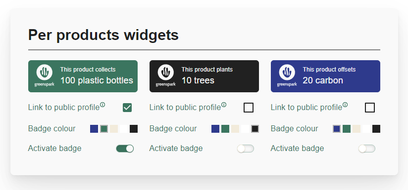
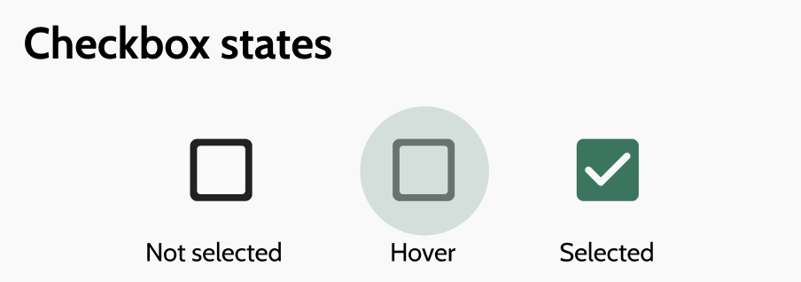
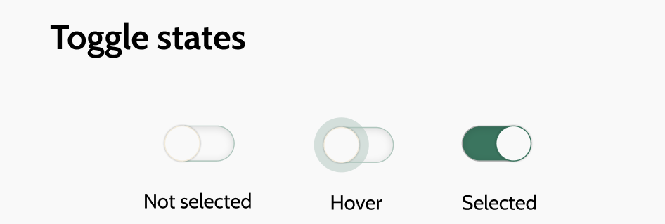
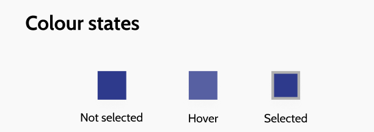
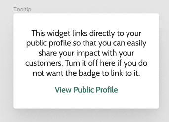
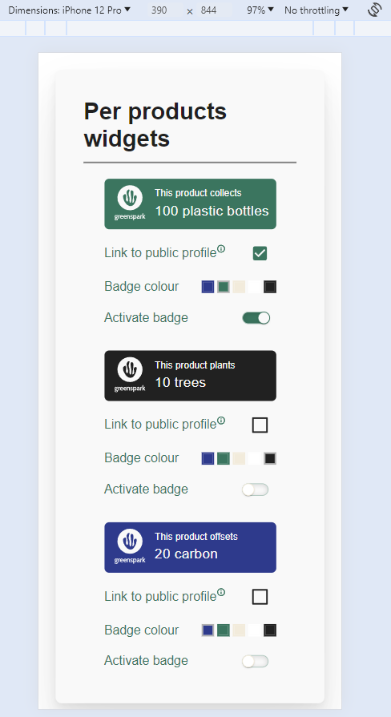
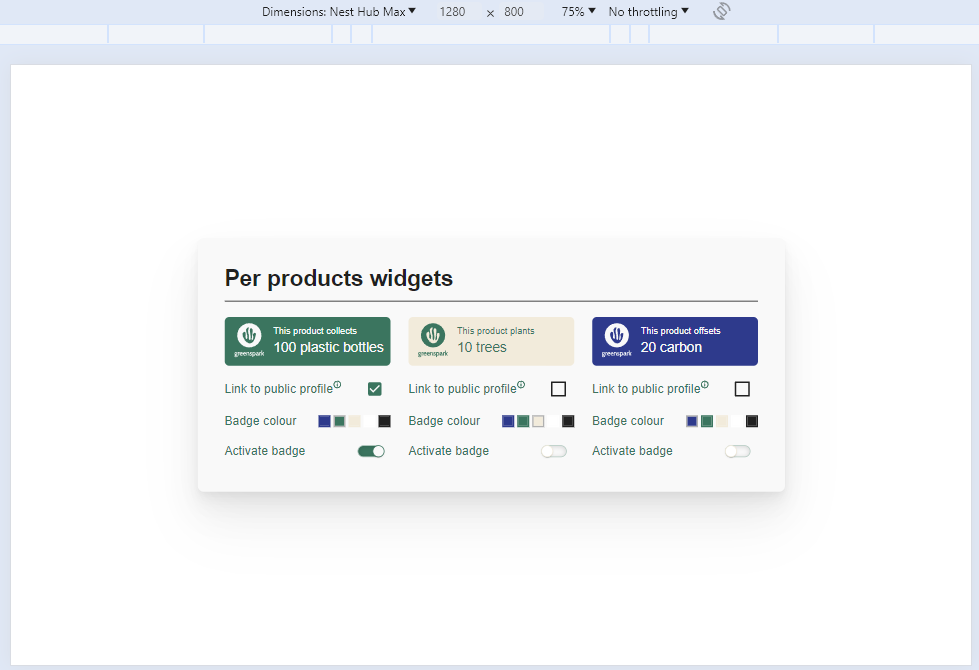
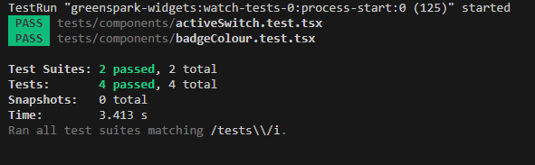

# MUI Components override app

This project is a frontend coding task to show how to set up an MUI theme and override the styling of MUI components.

## Getting Started with this project

To get started with this project, clone this repo with

`git clone {repo url or ssh link}`

Once it has been cloned locally, in the terminal at root level, you can use these commands to install and get the project running:

`npm i`

`npm start`

Once it is running, you can navigate to your browser, at http://localhost/3000, to see the app.

## Technologies

This project was built using:

- ReactJS
- Typescript
- MUI library
- Redux
- Jest
- React testing library

## Structure of the project

The project folder and general setup have been structured as a full app and open for possible extensions, with a folder split for:

- routes and layout
- redux store
- theming
- pages and components
- types
- assets
- tests

## Widget page

The widget page is our example page. It essentially contains a card with widget cards, and the user can interact with the cards to change their style, link a widget to their profile, and activate a widget.

The page's functional requirements are as follow:

- As a user I want to see my product widgets.
- As a user I want to customize my widgets by changing their colors, active state and
  whether it’s linked to my public profile (using client-side state management)
- Only one widget can have the active state at a time

## MUI override

The objective is to achieve building this page and using MUI components while respectiing the styling requirements in this overall layout:

When integrating the design aspects, we can note that the widget cards have a recurring main colour #3B755F which will be set as the app theme colour because texts and components behaviour are customised with this colour throughout, so this is set up as the primary.main colour in the app's palette in the theme.

The components we will override are as follow:

- checkbox (unchecked icon and checked icon, hover style)
- radio buttons (unchecked icon and checked icon, hover style)
- toggle/switch button (shape, colours in on and off states, hover)
- tooltip (card style and content style)

All app-wide settings like breakpoints and font choices are applied at theme definition level (in theme/index.tsx). The app-wide main colours are applied at palette definition (in theme/palette.tsx).

Component overrides are all set up in the theme/overrides folder, where we have the following structure:

- each component that needs an override has its own file which contains the override requirements
- the file theme/overrides/index.tsx file merges the individual overrides and prepares it ready to be applied into the main theme
- the override merge is applied to the theme in theme/index.tsx

Below is a target view of the components:

Checkbox - border, checked colour and hover colour

Toggle/Switch - colour, borders and hover colour

Radio buttons - unchecked and checked shapes, border and hover colour

Tooltip - colour, content style and box shadow

## Current capabilities of the app

At this stage, the app has only 1 page, the Widgets page, and both the widgets route and the base route land on this page.

Retrieval of data is limited to widget information, but it is processed by the custom middleware to simulate the retrieval of a full user profile on page load which would contain the widget details. On data received, the redux store is updated with this data, which is then read by the Widgets page.

The widgets page and its components are built using layout MUI components such as Stack or Box, and custom styling is applied via inline styling.

The widget card displays the information about 1 widget and also allows the user to interact with it to change some widget properties. Changes are dispatched to the store using the dispatch function.

## Mobile-first design

The widgets page and its components are set up with the relevant styling so that they wrap into a column on small screens, and align in a row on larger screens.

## Testing

The project is set up to test with jest and react-testing library. The test folder contains a few tests set up for a couple of components as a starting point to testing the page. Further tests would be needed for a full comprehensive testing of the page and all its design and behaviours.

Using the instruction `npm test` in the terminal will run the tests and the response should look like this:

## Limitations and further development

Due to the task being an override example, its development is limited in context and time, but further aspects could be explored and improved for a more complete app:

- further styling of the page, including override of additional components
- further unit testing for all components
- storybook added to the repo and adding visual and accessibility testing to the components
