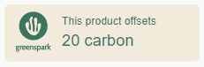

# Greenspark Widget app

This project is a frontend coding challenge for Greenspark. There was freedom to use any framework or library to build it so I personally chose ReactJS, TypeScript and Jest which are the language, framework and library I am most comfortable with currently.

## Getting Started with this project

To get started with this project, clone this repo with

`git clone {repo url or ssh link}`

Once it has been cloned locally, in the terminal at root level, you can use these commands to install and get the project running:

`npm i`

`npm start`

Once it is running, you can navigate to your browser, at http://localhost/3000, to see the app.

## Technologies

This project was built using:

- ReactJS
- Typescript
- MUI library
- Redux
- Jest
- React testing library

## Structure of the project

The project folder and general setup have been structured for possible extensions, with a folder split for:

- routes and layout
- redux store
- theming
- pages and components
- types
- assets
- tests

## Widget page

The widget page essentially contains a card with widget cards, and the user can interact with the cards to change their style, link a widget to their profile, and activate a widget.

The functional requirements are as follow:

- As a user I want to see my product widgets.
- As a user I want to customize my widgets by changing their colors, active state and
  whether it’s linked to my public profile (using client-side state management)
- Only one widget can have the active state at a time

The styling requirements are as per this [figma](https://www.figma.com/file/EpzAE594mkDkMvg09WTqpb/Frontend-task?type=design&node-id=8-35&mode=design&t=z7v0Cz5fJXtBL25L-0) design.
When integrating the design aspects, we can note that the widget cards have a recurring main colour #3B755F which could be considered the app theme colour because texts and components behaviour are customised with this colour throughout, so this is set up as the primary.main colour in the app's palette in the theme.

Checkbox checked colour and hover colour

Toggle colour and borders and hover colour

Text font and contrasting logo on light background colours

Overall view of widgets:

## Current capabilities of the app

At this stage, the app has only 1 page, the Widgets page, and both the widgets route and the base route land on this page.

Retrieval of data is limited to widget information, but it is processed by the custom middleware to simulate the retrieval of a full user profile on page load which would contain the widget details. On data received, the redux store is updated with this data, which is then read by the Widgets page.

The widgets page and its components are built using layout MUI components such as Stack or Box, and custom styling is applied via inline styling.

The widget card displays the information about 1 widget and also allows the user to interact with it to change some widget properties. Changes are dispatch to the store using the dispatch function.
The card uses MUI components such as Radio, CheckBox and Switch components. Overrides and custom props have been set up so that the components are styled according to the figma design.

## Mobile-first design

The widgets page and its components are set up with the relevant styling so that they wrap into a column on small screens, and align in a row on larger screens.

## Testing

The project is set up to test with jest and react-testing library. The test folder contains a few tests set up for a couple of components as a starting point to testing the page. Further tests would be needed for a full comprehensive testing of the page and all its design and behaviours.

Using the instruction `npm test` in the terminal will run the tests and the response should look like this:

## Limitations and further development

Due to the task being a coding challenge, its development is limited in context and time, but further aspects could be explored further and improved for completeness:

- further styling of the page, including styling of the switch component
- add further unit testing for all components
- add storybook to the repo and add visual and accessibility testing
