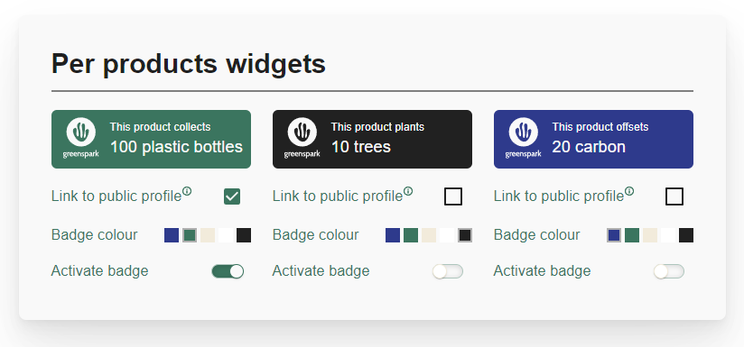
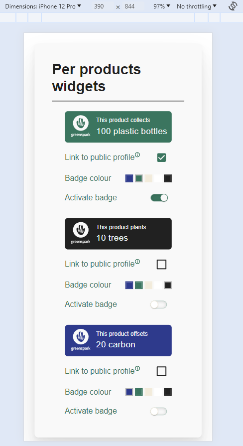

# Greenspark Widget app

## Getting Started with this project

To get started with this project, clone this repo with

`git clone {repo url or ssh link}`

Once it has been cloned locally, in the terminal at root level, you can use these commands to install and get the project running:
`npm i`
`npm start`

Once it is running, you can navigate to your browser, at http://localhost/3000, to see the app.

## Technologies

This project was build using React and Typescript and components from the MUI library.

## Structure of the project

The project folder and general setup have been structured for possible extensions, which includes a folder split for:

- routes and layout
- redux store
- theming
- pages and components
- types
- assets

## Widget page

The widget page essentially contains a card with widget cards, and the user can interact with the cards to change their style, link a widget to their profile, and activate a widget.

The functional requirements are as follow:

- As a user I want to see my product widgets.
- As a user I want to customize my widgets by changing their colors, active state and
  whether it’s linked to my public profile (using client-side state management)
- Only one widget can have the active state at a time

The styling requirements are as per this [figma](https://www.figma.com/file/EpzAE594mkDkMvg09WTqpb/Frontend-task?type=design&node-id=8-35&mode=design&t=z7v0Cz5fJXtBL25L-0) design.

## Current capabilities of the app

At this stage, the app has only 1 page, the Widgets page, and both the widgets route and the base route land on this page.
Retrieval of data is limited to widget information, but it is processed by the custom middleware to simulate the retrieval of a full user profile which would contain the widget details. On data received, the redux store is updated with this data, which is then read by the Widgets page.

The widget card displays the information about 1 widget and also allows the user to interact with it to change some widget properties. The card uses MUI components such as Radio, CheckBox and Switch components. Overrides and custom props have been set up so that the components are styled according to the figma design.

## Mobile-first design

The widgets page and its components are set up with the relevant properties so that they display as a column on small screens.

## Limitations and further development

Due to the task being a coding challenge, its development is limited in context and time, but further aspects could be explored further and improved for completeness:

- further styling of the switch component
- add unit testing of all components
- add storybook to the repo and add visual, accessibility and interaction testing
